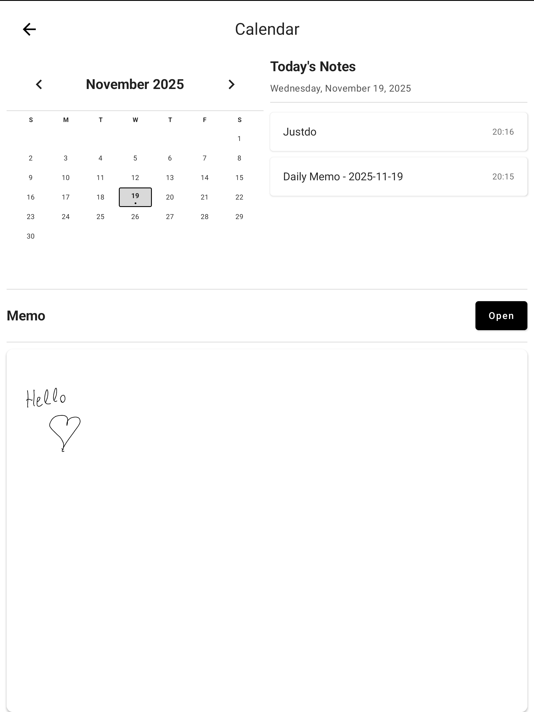
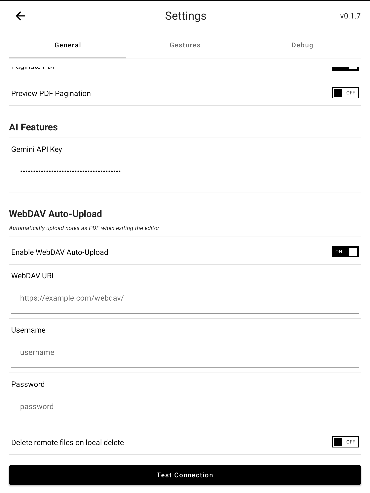
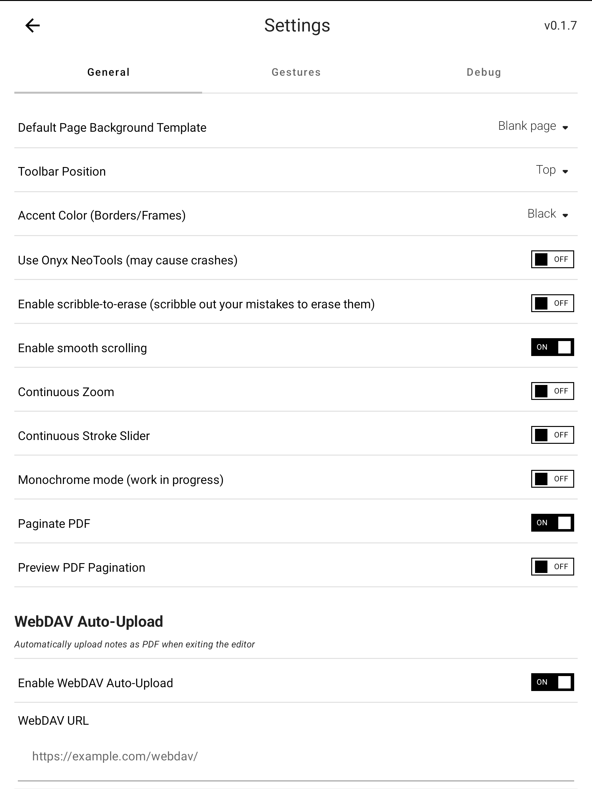

# Notable - Enhanced Fork

This is a vibe-coded fork of [Notable](https://github.com/Ethran/Notable), a handwriting note-taking app for Android e-ink devices.

## Added Features

### WebDAV Auto-Sync (NEW!)
- **Auto-upload PDFs to WebDAV server** when exiting a notebook
- **Automatic PDF export and sync** - no manual export needed
- **Test connection** with file upload verification
- **Auto-delete remote files**: Optional setting to delete PDFs from WebDAV when deleting notebooks locally
- **Flat folder structure**: All PDFs stored in `Notable/*.pdf`
- **Auto-overwrite**: Existing PDFs are automatically updated
- Configuration: WebDAV URL, username, password in Settings

### Calendar View with Daily Memos
- **Split-pane layout**: Calendar grid + Today's Notes on top, Daily Memo preview on bottom
- **Auto-select today's date** when opening calendar
- **Render actual strokes** in memo preview - see what you wrote without opening
- **Daily Memos**: Automatically create/open date-specific notes for any date
- **Activity indicators**: Dots on dates with notebook activity
- **Today's Notes list**: Shows all notebooks edited on selected date

### UI Improvements
- **Color customization**: 7 accent colors (Black, Blue, Red, Green, Orange, Purple, Teal)
- **Optimized for Boox Air4C** color e-ink display
- **Improved calendar layout**: Optimized spacing and proportions (35% top, 65% memo)

## Screenshots

<p float="left">
  
   
  
</p>

## How to Use

### WebDAV Auto-Sync
1. Go to Settings > WebDAV section
2. Enable "Enable WebDAV Auto-Upload"
3. Enter your WebDAV URL, username, and password
4. Click "Test Connection" to verify setup
5. PDFs will automatically upload when you exit any notebook
6. Optional: Enable "Delete remote files on local delete" to sync deletions

### Calendar
1. Tap calendar icon in home screen
2. Select any date to view notebooks edited that day
3. View/edit daily memo in the bottom preview area
4. Click "Open" to edit memo in full screen

### Color Themes
1. Go to Settings > UI Customization
2. Select your preferred accent color
3. Calendar, buttons, and highlights will update to match

## Building

```bash
./gradlew assembleDebug
```

APK output: `app/build/outputs/apk/debug/app-debug.apk`

## Credits

Based on [Notable by Ethran](https://github.com/Ethran/Notable)

Enhancements vibe-coded with Claude Code.
