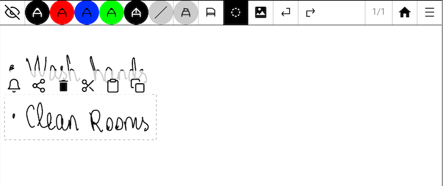
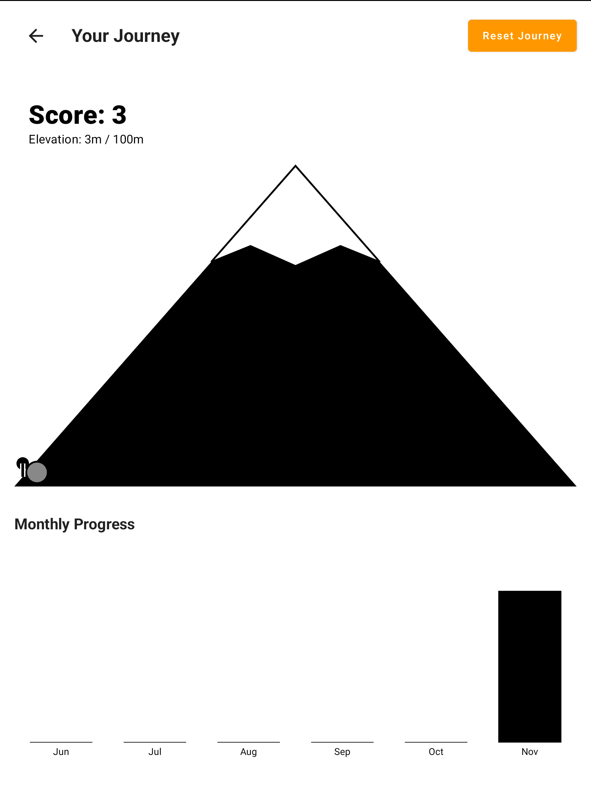
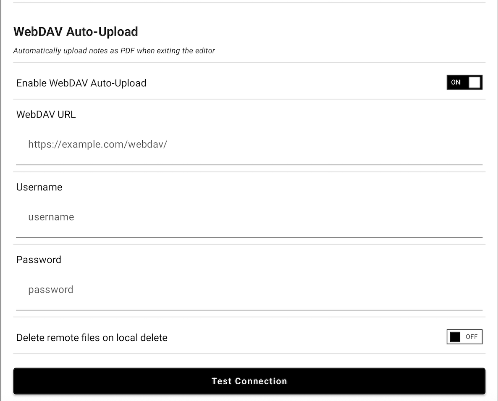

# Notable - Enhanced Fork

This is a vibe-coded fork of [Notable](https://github.com/Ethran/Notable), a handwriting note-taking app for Android e-ink devices.

## Features

### 📅 Calendar & Daily Memos
- **Split-pane layout**: Calendar grid + Today's Notes on top, Daily Memo + To-Do on bottom.
- **Daily Memos**: Automatically create/open date-specific notes for any date.
- **Activity indicators**: Dots on dates show notebook activity.
- **Preview**: See actual strokes in the memo preview without opening.

### 🤖 AI To-Do Generation
Transform your handwritten notes into digital tasks instantly.
- **Lasso & Convert**: Select any handwriting with the Lasso tool and tap the **Bell Icon**.
- **Gemini Powered**: Uses **Google Gemini 2.0 Flash** for high-accuracy recognition.
- **Integrated Workflow**: Tasks appear immediately in your daily To-Do list.

<p float="left">
  
   
</p>

### 🏔️ Gamified Stats
Stay motivated with visual progress tracking.
- **Mountain Climb**: Every completed task moves your character up the mountain. Reach the summit every 100 tasks!
- **Monthly Insights**: Track your productivity with an E-Ink optimized bar chart.
- **Reset Journey**: Start fresh whenever you want.

<p align="center">
  
</p>

### ☁️ WebDAV Auto-Sync
Seamlessly backup your notes.
- **Auto-Upload**: PDFs are uploaded automatically when you exit a notebook.
- **Background Sync**: No manual export required.

---

## How to Use

### Calendar Navigation
1.  **Open Calendar**: Tap the calendar icon on the home screen.
2.  **Select Date**: Tap any date to view activity for that day.
3.  **Today's Notes**: The top-right list shows all notebooks edited on the selected date.
4.  **Daily Memo**: The bottom-left section lets you **Create** or **Open** a dedicated note for that day.

### Using AI Features
1.  **Setup**: Go to **Settings > AI Features** and enter your Gemini API Key.
2.  **Create To-Do**: In any note, select text with the **Lasso Tool** and tap the **Bell**.
3.  **View Stats**: In the Calendar view, tap the **Chart Icon** in the "To-Do" header.

### Configuring WebDAV
Go to **Settings > WebDAV** to set up your cloud storage.

<p align="center">
  
</p>

## Building

```bash
./gradlew assembleDebug
```

APK output: `app/build/outputs/apk/debug/app-debug.apk`

## Credits

Based on [Notable by Ethran](https://github.com/Ethran/Notable)

Enhancements vibe-coded with Claude Code.
