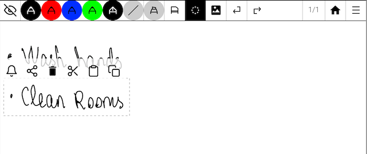
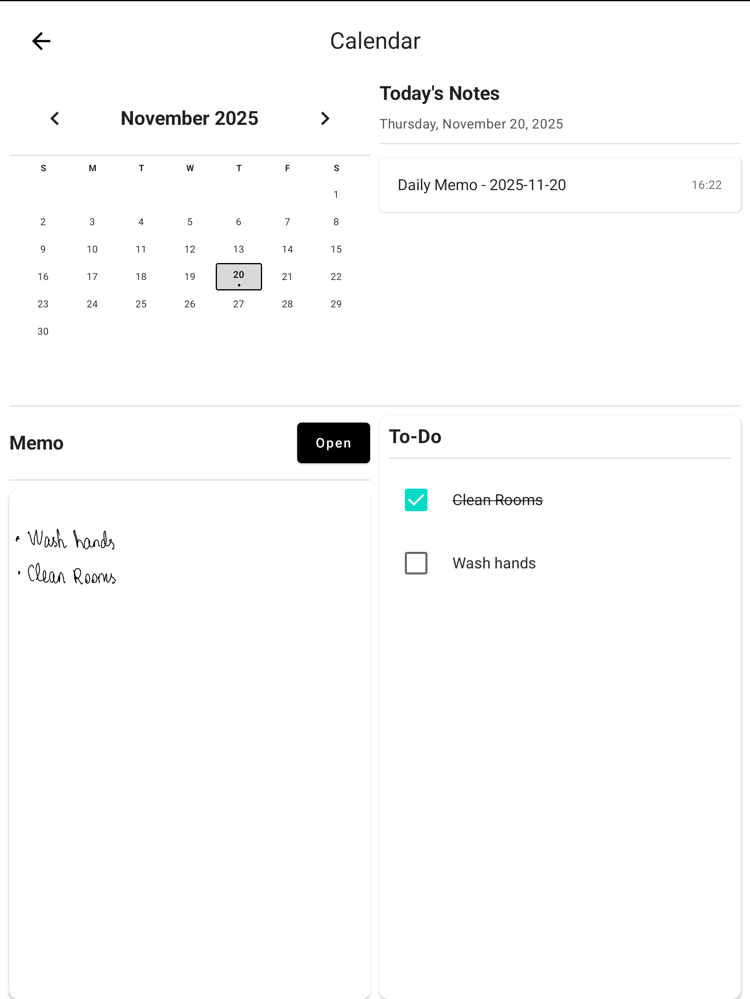
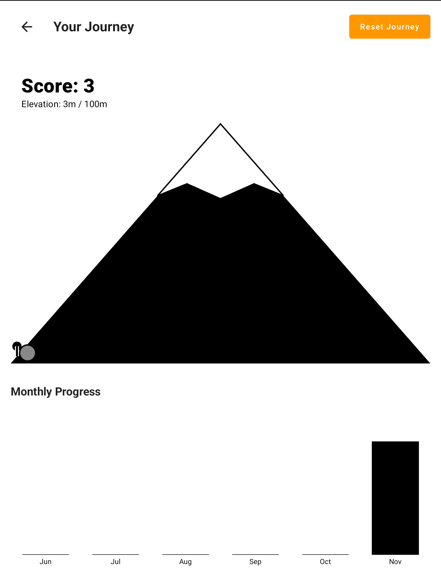
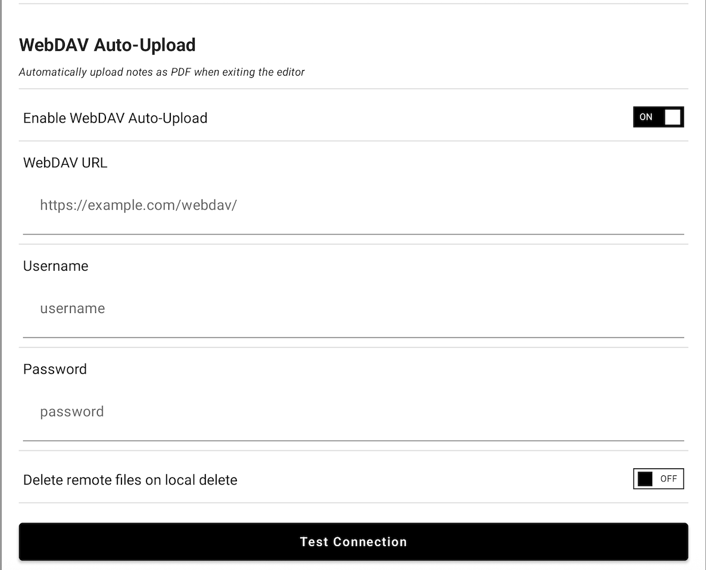

# Notable Enhanced

Notable Enhanced is an e-ink focused fork of [Notable](https://github.com/Ethran/Notable), built for handwritten notes, daily planning, and lightweight task management on Android e-paper devices.

It keeps the original notebook workflow and adds a more opinionated layer around daily use: calendar-driven notes, AI-assisted to-do capture, visual progress tracking, and WebDAV-based backup.

## Download

- Latest release: [v0.4.1 - E-Ink Optimization](https://github.com/seconion/notable-enhanced/releases/tag/v0.4.1)
- Installable test APK: [notable-enhanced-v0.4.1-debug.apk](https://github.com/seconion/notable-enhanced/releases/download/v0.4.1/app-debug.apk)

### Install

1. Download the APK to your device.
2. Open it and allow installation from unknown sources if Android asks.
3. Launch the app and grant the storage permissions it needs for notebooks, imports, and exports.

## What This Fork Adds

### Calendar and Daily Memo Workflow

- Open notes by date instead of hunting through folders.
- Keep a dedicated daily memo for each day.
- See notebook activity directly from the calendar view.
- Jump from a date into related notes without breaking the notebook flow.

### AI To-Do Capture

- Select handwriting with the lasso tool and convert it into reminders.
- Choose between **Gemini** for a hosted setup or **Ollama** for a self-hosted workflow.
- Push extracted tasks directly into the in-app reminder flow.

### E-Ink Friendly Stats

- Track completed reminders over time.
- Use the mountain-climb progress view as a lightweight motivation loop.
- Review activity in layouts that are readable on monochrome devices.

### WebDAV Backup

- Export notebooks to PDF on exit and upload them automatically.
- Keep remote copies aligned with the notebook workflow instead of running manual exports.

## Screenshots

<p float="left">
  
  
</p>

<p float="left">
  
  
</p>

## AI Setup

Go to **Settings** and choose the backend you want to use.

### Gemini

- Enter a Gemini API key.
- Best when you want the fastest setup and do not want to run local infrastructure.

### Ollama

- Enter your Ollama server URL and model name.
- Best when you want a self-hosted path with more control over privacy and cost.

Example server setup:

```bash
curl -fsSL https://ollama.com/install.sh | sh
ollama pull minicpm-v
OLLAMA_HOST=0.0.0.0:11434 ollama serve
```

Recommended models:

- `minicpm-v`
- `llama3.2-vision`
- `llava`

## Building

```bash
./gradlew assembleDebug
./gradlew assembleRelease
```

Outputs:

- Debug APK: `app/build/outputs/apk/debug/app-debug.apk`
- Release APK: `app/build/outputs/apk/release/app-release-unsigned.apk`

## Credits

- Original project: [Ethran/Notable](https://github.com/Ethran/Notable)
- Enhanced fork and feature work: [seconion/notable-enhanced](https://github.com/seconion/notable-enhanced)
