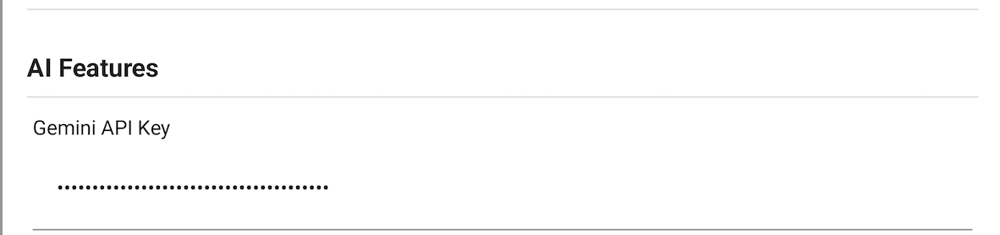

# Notable - Enhanced Fork

This is a vibe-coded fork of [Notable](https://github.com/Ethran/Notable), a handwriting note-taking app for Android e-ink devices.

## 📥 Download & Install
**[Download Latest APK (v0.3.1)](https://github.com/seconion/notable-enhanced/releases/download/v0.3.1/notable-enhanced-v0.3.1.apk)**

**How to Install:**
1.  Click the link above to download the `.apk` file to your device.
2.  Open the file and tap **"Install"** (You may need to allow installation from unknown sources).
3.  Enjoy!

## Features

### 📅 Calendar & Daily Memos
- **Split-pane layout**: Calendar grid + Today's Notes on top, Daily Memo + To-Do on bottom.
- **Daily Memos**: Automatically create/open date-specific notes for any date.
- **Activity indicators**: Dots on dates show notebook activity.
- **Preview**: See actual strokes in the memo preview without opening.

### 🤖 AI To-Do Generation
Transform your handwritten notes into digital tasks instantly.
- **Lasso & Convert**: Select any handwriting with the Lasso tool and tap the **Bell Icon**.
- **Dual Backend Support**: Choose between **Google Gemini** (cloud) or **Ollama** (self-hosted).
- **Integrated Workflow**: Tasks appear immediately in your daily To-Do list.

**Supported AI Backends:**
| Backend | Type | Best For |
|---------|------|----------|
| Gemini 2.0 Flash | Cloud | Quick setup, no server needed |
| Ollama (minicpm-v) | Self-hosted | Privacy, no API costs, offline capable |

<p float="left">
  
  
</p>

### 🏔️ Gamified Stats
Stay motivated with visual progress tracking.
- **Mountain Climb**: Every completed task moves your character up the mountain. Reach the summit every 100 tasks!
- **Monthly Insights**: Track your productivity with an E-Ink optimized bar chart.
- **Reset Journey**: Start fresh whenever you want.

<p align="center">
  
</p>

### ☁️ WebDAV Auto-Sync
Seamlessly backup your notes.
- **Auto-Upload**: PDFs are uploaded automatically when you exit a notebook.
- **Background Sync**: No manual export required.

---

## How to Use

### Calendar Navigation
1.  **Open Calendar**: Tap the calendar icon on the home screen.
2.  **Select Date**: Tap any date to view activity for that day.
3.  **Today's Notes**: The top-right list shows all notebooks edited on the selected date.
4.  **Daily Memo**: The bottom-left section lets you **Create** or **Open** a dedicated note for that day.

### Using AI Features
1.  **Setup**: Go to **Settings > AI Features** and choose your backend:
    - **Gemini**: Enter your Google Gemini API Key
    - **Ollama**: Enter your server URL (e.g., `http://192.168.1.100:11434`) and model name
    <p align="center">
      
    </p>
2.  **Create To-Do**: In any note, select text with the **Lasso Tool** and tap the **Bell**.
3.  **View Stats**: In the Calendar view, tap the **Chart Icon** in the "To-Do" header.

### Setting up Ollama (Self-hosted AI)
For privacy-focused or offline use, you can run your own AI server:

```bash
# Install Ollama on your server/PC
curl -fsSL https://ollama.com/install.sh | sh

# Pull a vision model (minicpm-v recommended for best OCR)
ollama pull minicpm-v

# Start Ollama (bind to all interfaces for network access)
OLLAMA_HOST=0.0.0.0:11434 ollama serve
```

**Recommended models:** `minicpm-v` (best accuracy), `llama3.2-vision`, `llava`

### Configuring WebDAV
Go to **Settings > WebDAV** to set up your cloud storage.

<p align="center">
  
</p>

## Building

```bash
./gradlew assembleDebug
```

APK output: `app/build/outputs/apk/debug/app-debug.apk`

## Credits

Based on [Notable by Ethran](https://github.com/Ethran/Notable)

Enhancements vibe-coded with Claude Code.
